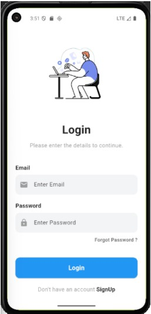
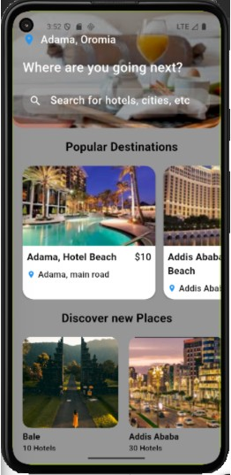
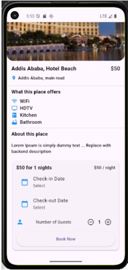
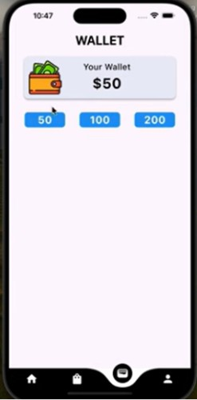
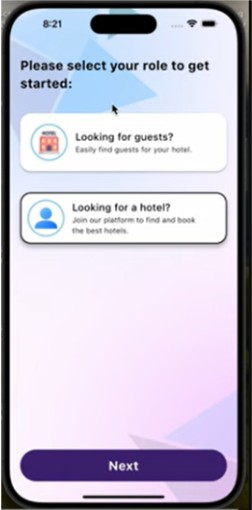

# 🏨 Hotel Booking & Management Application

**A Production-Ready, Scalable Flutter MVP built with Clean Architecture & BLoC.**

## 📌 Overview
This project is a comprehensive **Hotel Booking & Management System** designed to demonstrate **engineering maturity** and **production readiness**. It serves as a unified platform connecting:
- **Travelers** searching for premium stays.
- **Hotel Owners** managing listings and bookings.
- **Admins** overseeing the platform ecosystem.

Built with **Flutter** and **Firebase**, the app prioritizes **scalability**, **maintainability**, and a **premium user experience**. It features a robust **Clean Architecture**, feature-first modularization, and advanced integrations like **Google Maps** and a custom **Wallet System**.

---

## 🚀 Key Features

### 👤 End Users (Travelers)
- **Smart Discovery**: Advanced search with filtering (price, amenities, location).
- **Interactive Maps**: integrated Google Maps to find hotels nearby.
- **Seamless Booking**: Real-time availability checks and instant reservation.
- **Digital Wallet**: Secure Top-up and payment processing.
- **Review System**: User ratings and feedback integration.

### 🏨 Hotel Owners
- **Property Management**: Create and edit hotel listings with rich media.
- **Booking Dashboard**: Real-time tracking of upcoming and past reservations.
- **Analytics**: Insights into booking trends and revenue.

### 🛡️ Admin / Platform
- **Super Dashboard**: Global view of all users, hotels, and transactions.
- **User Management**: Role-based access control (RBAC).
- **System Health**: Monitoring of platform activity.

---

## 📱 App Screens

| **Authentication** | **Home & Discovery** | **Hotel Details** |
|:---:|:---:|:---:|
| <br>_Secure Email/Password Login_ | <br>_Curated Hotel Listings_ | <br>_Rich Property Info_ |

| **Booking Flow** | **Payments** | **Profile & Roles** |
|:---:|:---:|:---:|
| <br>_Instant Reservation_ | <br>_Secure Wallet Transactions_ | <br>_Dynamic Role Switching_ |

---

## 🏗️ Architecture Overview

The project adheres to **Uncle Bob’s Clean Architecture**, enforcing a strict separation of concerns to ensure testability and maintainability.

### **Layers & Responsibilities**
1.  **Presentation Layer**:
    *   **BLoC (Business Logic Component)**: Manages state and events.
    *   **Widgets**: Passive UI components observing state changes.
2.  **Domain Layer** (Inner Core):
    *   **Entities**: Pure Dart classes representing business objects.
    *   **Use Cases**: Encapsulate specific business rules (e.g., `CreateBookingUseCase`).
    *   **Repositories (Interfaces)**: Defines contracts for data operations.
3.  **Data Layer**:
    *   **App Logic**: Manages platform roles.
    *   **Repositories (Implementations)**: Orcherstrates data fetching.
    *   **Data Sources**: Direct interaction with APIs (Firebase, Google Maps).

### **Design Decisions**
*   **Feature-First Modularization**: Code is organized by feature (`/features/auth`, `/features/booking`) rather than layer, allowing checking scalability and team parallelism.
*   **Dependency Injection (DI)**: functional `GetIt` (`sl`) is used to decouple dependencies, making unit testing straightforward.
*   **Immutability**: `Equatable` is used for value equality in States and Events.

---

## 🛠️ Tech Stack

### **Core**
*   **Framework**: Flutter (Dart)
*   **State Management**: `flutter_bloc`
*   **Navigation**: `go_router`
*   **Dependency Injection**: `get_it`

### **Backend & Services**
*   **Firebase Ops**: Auth, Firestore, Cloud Functions (for atomic operations).
*   **Maps**: `google_maps_flutter`, `google_maps_webservice`.
*   **Location**: `geolocator`.

### **Utilities**
*   **Functional Programming**: `fpdart` (for `Either<Failure, Success>` error handling).
*   **Storage**: `shared_preferences` (local caching).
*   **Offline**: `internet_connection_checker`.

---

## 📦 Feature Modules

The codebase (`/lib/features`) is structured into distinct domains:

*   **`auth`**: Handles Login, Signup, and Session persistence.
*   **`booking`**: Core logic for reservations, availability checks, and cancellations.
*   **`hotel`**: Management of hotel data, search indexing, and details.
*   **`location`**: Geolocation services and map integration.
*   **`payments`**: Payment processing logic (simulated gateway).
*   **`wallet`**: managing user balances and transaction history.
*   **`admin`**: Privileged operations for platform oversight.
*   **`owner`**: Vendor-specific tools for property management.
*   **`profile`**: User settings and profile management.

---

## 🗺️ Maps & Location

The app leverages **Google Maps Platform** for a location-centric experience.

*   **Integration**: `google_maps_flutter` renders the interactive map.
*   **Places API**: `google_maps_webservice` powers the Autocomplete search.
*   **Configuration**: API Keys are secured via `android/local.properties` and injected at build time.

---

## 💳 Payments & Wallet System

A custom closed-loop **Wallet System** handles transactions:

*   **Balance Management**: Users can top-up their wallet.
*   **Atomic Transactions**: Payment processing uses Cloud Functions to ensure that creating a booking and deducting funds happen atomically or not at all.
*   **Extensibility**: The `PaymentRepository` is designed to be easily swapped with real providers like Stripe or Razorpay.

---

## 🔥 Firebase Integration

*   **Authentication**: Email/Password and social auth flows.
*   **Firestore**: NoSQL database structured for read-heavy workloads (Hotel feeds).
*   **Security Rules**: granular rules ensuring users can only edit their own data.
*   **Indexes**: Composite indexes configured for complex queries (e.g., filtering hotels by price AND location).
*   **Offline Persistence**: Firestore's built-in offline cache is enabled for seamless UX in low connectivity.

---

## 🚀 Environment Setup

1.  **Clone the Repository**:
    ```bash
    https://github.com/game-ale/hotel-booking-app.git
    cd hotel-booking-app
    ```

2.  **API Keys**:
    Create a `.env` file or update `local.properties` (Android) with your keys:
    ```properties
   
    ```

3.  **Firebase Config**:
    *   Ensure `google-services.json` is placed in `android/app/`.

---

## 🏃 Installation & Run (Android)

1.  **Install Dependencies**:
    ```bash
    flutter pub get
    ```

2.  **Run the App**:
    ```bash
    flutter run
    ```
    *Select your Android Emulator or Physical Device.*

---

## 🧪 Testing Strategy

*   **Unit Tests**: Core business logic (UseCases) and Utilities are tested.
*   **Widget Tests**: High-priority components (e.g., Custom Buttons, Cards) are verified.
*   **Manual Testing**: Full end-to-end regression testing performed on Android Emulators (Pixel 6, API 33).
*   *Note: Integration tests are currently planned for the next sprint.*

---

## ⚡ Performance & Offline Strategy

*   **Caching**: `shared_preferences` caches user session and settings.
*   **Firestore Persistence**: Enables reading hotel lists even when offline.
*   **Pagination**: Handled via Firestore limits to reduce read costs and improve load times.
*   **Image Optimization**: Network images are cached to minimize bandwith usage.

---

## 🔄 CI/CD & Production Readiness

*   **Workflow**: configured via **GitHub Actions**.
*   **Checks**: Automates `flutter analyze` and `flutter test` on every Pull Request.
*   **Architecture**: The codebase is strictly typed and linted (`flutter_lints`) to maintain high quality.

---

## ⚠️ Known Limitations

*   **Payment Gateway**: Currently uses a simulated wallet system; external gateway integration is in progress.
*   **iOS Support**: Primary development focused on Android; iOS build requires additional Runner configuration.

---

## 🛤️ Roadmap & Future Enhancements

*   [ ] Integration of Stripe/Razorpay for direct payments.
*   [ ] Real-time Chat between Travelers and Hotel Owners.
*   [ ] Advanced Analytics Dashboard for Owners (Charts/Graphs).
*   [ ] Dark Mode support (System-wide).
*   [ ] Localization

---

## 👨‍💻 Author

**Gemechu Alemu**
*Intermediate Flutter Engineer*

*   [Email](alemugemechu@gmail.com)
